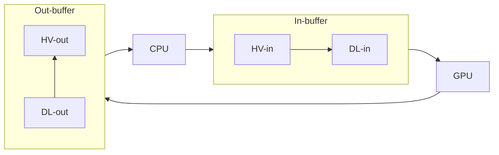

# Collatz Conjecture Simulator

A program to efficiently determine the total stopping time of the Collatz sequence of any 128-bit integer starting
value, and output all starting values $n$ whose total stopping time is the greatest of all integers in the interval
$[1, n]$.

## Mathematical Notation

For the purposes of this document, the following mathematical symbols will represent the corresponding concepts.

- $\mathbb{Z}$ represents the set of all integers.
- $\mathbb{Z}^+$ represents the set of all positive integers.
- $\mathbb{Z}^{0+}$ represents the set of all non-negative integers.
- $f(n)$ represents the Collatz function applied to $n$.
- $f^k(n)$ represents the Collatz function applied recursively $k$ times to $n$.
- $s(n)$ represents the total stopping time of the starting value $n$.

## The Collatz Conjecture

The [Collatz Conjecture](https://en.wikipedia.org/wiki/Collatz_conjecture) is a famous unsolved mathematical problem. It
regards the _Collatz function_, a mathematical function which takes a positive integer input $n$ and gives a positive
integer output $f(n)$. If the input is even, the function returns half the input. If the input is odd, the function
returns triple the input, plus one.

```math
f(n) =
 \begin{cases}
  \frac{1}{2} n & \text{if } n \equiv 0 \pmod 2 \\
  3n + 1        & \text{if } n \equiv 1 \pmod 2
 \end{cases}
```

The Collatz function can be applied recursively, meaning given an initial input $n$ and resultant output $f(n)$, this
first output can be used as an input, resulting in a second output $f(f(n))$. This second output can again be used as an
input, resulting in a third output $f^3(n)$. And so on.

By applying the Collatz function recursively, the sequence of successive inputs and outputs will form a _Collatz
sequence_. If a Collatz sequence includes the value $1$, then the number of elements in the sequence from the starting
value to the first instance of the value $1$ is the _total stopping time_. That is, given a starting value $n$ and total
stopping time $k$, $f^k(n) = 1$.

The Collatz Conjecture states that for all positive integer starting values $n$, finite recursive application of the
Collatz function will eventually result in the value $1$. Or, expressed with mathematical logic:

```math
\forall n \in \mathbb{Z}^+, \exists k \in \mathbb{Z}^{0+} : f^k(n) = 1
```

## The Simulation

Collatz Conjecture Simulator aims to find the Collatz sequences with the greatest total stopping times. That is,
positive integer values $n$ such that of the set of integers in the interval $[1, n]$, the starting value with the
greatest total stopping time is $n$.

```math
n \in \mathbb{Z}^+ : \forall x \in \{ p \in \mathbb{Z}^+ : p < n \}, s(n) > s(x)
```

Total stopping times are calculated by iterating through Collatz sequences and counting each step (application of the
Collatz function) until a value of $1$ is found. Due to every iteration through a Collatz sequence being computationally
independent of any other, it is possible to calculate the total stopping times of multiple starting values
simultaneously. As such, the program uses the GPU to iterate through multiple Collatz sequences in parallel. The GPU is
accessed via the Vulkan API, and uses compute shaders to perform the iterations. Collatz Conjecture Simulator is
primarily written in C, however the shaders are written in GLSL and compiled to SPIR-V.

## Program Requirements

The general environment and system requirements that must be met for Collatz Conjecture Simulator to build and run
correctly. The full requirements of the GPU are given in [device_requirements.md](device_requirements.md).

- [CMake](https://cmake.org) 3.23
- [pthreads](https://en.wikipedia.org/wiki/Pthreads)
- [glslang](https://github.com/KhronosGroup/glslang)
- [SPIR-V Tools](https://github.com/KhronosGroup/SPIRV-Tools)
  - `spirv-link`
  - `spirv-opt`
  - `spirv-dis`
- [C](https://en.wikipedia.org/wiki/C_(programming_language))17
  - `_Atomic` (Optional C11 feature)
  - `__int128` (GNU C extension)
- [Vulkan](https://www.vulkan.org) 1.1
  - `synchronization2`
  - `timelineSemaphore`

## Building and Running

Collatz Conjecture Simulator is built via CMake. Comprehensive documentation regarding usage of CMake can be found
[here](https://cmake.org/cmake/help/latest). To generate the build system, navigate the terminal to the project
directory and execute the following command.

```bash
cmake -S . -B build
```

Several options can be optionally specified to customise the build system by appending `-D OPTION=CONFIG` to the above
command.

- `CMAKE_BUILD_TYPE` specifies the build variant and can be set to _Debug_, _Release_, _MinSizeRel_, or
  _RelWithDebInfo_. If not set, it defaults to _Debug_.
- `EXCESS_WARNINGS` specifies whether to compile the program with a potentially excessive amount of warnings, and
  defaults to _OFF_.
- `STATIC_ANALYSIS` specifies whether to statically analyse the program during compilation if compiling with GCC, and
  defaults to _OFF_.
- `DEBUG_SHADERS` specifies whether to include debug information in generated SPIR-V, and defaults to _OFF_.
- `OPTIMISE_SHADERS` specifies whether to optimise generated SPIR-V using `spirv-opt`, and defaults to _ON_.
- `DISASSEMBLE_SHADERS` specifies whether to disassemble generated SPIR-V using `spirv-dis`, and defaults to _OFF_.

Once the above command has finished, a `build` directory will have been created containing the build system. To now
build Collatz Conjecture Simulator, execute the following command.

```bash
cmake --build build
```

By default, only the executable will be built. To instead build the SPIR-V, add `--target spirv`. To build both, also
add `--target cltz`. To specify the build configuration, add `--config CONFIG` (only applies for multi-config
generators).

The above command will create a `bin` directory containing the SPIR-V and executable. If built in debug, the executable
will be named `cltz-dbg`. Otherwise, it will be named `cltz`. The executable must be run from within the `bin`
directory, else it will be unable to locate the generated SPIR-V.

The executable provides a command line interface and uses the initial command line parameters to specify the operation
of the program. Parameters beginning with a double hyphen (--) reference options. Some options themselves accept a
parameter, which must be given immediately following the option as the next CLI parameter. To view a comprehensive list
of possible options, use the `--help` option:

```bash
cltz --help
```

In most cases, the executable will initiate the program's main loop. If during this process the `Enter` or `Return` keys
are pressed, the program will break from the main loop and begin to exit. Each iteration of the main loop will output
information regarding the computations performed, most prominently including benchmarking data for various subprocesses.

## Inout-buffers

To facilitate this use of the GPU, _inout-buffers_ are used. Inout-buffers are ranges of GPU memory within `VkBuffer`
objects and consist of an _in-buffer_ and _out-buffer_. In-buffers are shader storage buffer objects (SSBOs) and contain
an array of 128-bit unsigned integer starting values. Out-buffers are also SSBOs and contain an array of 16-bit unsigned
integer total stopping times (step counts).

The main loop consists of the CPU writing starting values to in-buffers; the GPU reading starting values from
in-buffers, iterating through Collatz sequences, and writing step counts to out-buffers; and the CPU reading step
counts from out-buffers. The number of inout-buffers is dependent on the system's specifications. There are one or more
inout-buffers per `VkBuffer` object, one `VkBuffer` object per `VkDeviceMemory` object, and two or more `VkDeviceMemory`
objects.

Collatz Conjecture Simulator attempts to minimise the time spent idle by the CPU and GPU due to one waiting for the
other to complete execution. Such as the GPU waiting for starting values, or the CPU waiting for step counts. This is
done by having an even number of `VkDeviceMemory` objects, where half contain memory close to the GPU (device local
memory), and half contain memory visible to both the CPU and GPU (host visible memory). There are therefore four types
of memory ranges: host visible in-buffers (HV-in), host visible out-buffers (HV-out), device local in-buffers (DL-in),
and device local out-buffers (DL-out).

Rather than the CPU and GPU taking turns executing, both processors spend time running in parallel. The CPU reads and
writes host visible inout-buffers, and the GPU reads and writes device local inout-buffers, simultaneously. Starting
values are written to HV-in, copied from HV-in to DL-in, and read from DL-in. Step counts are written to DL-out, copied
from DL-out to HV-out, and read from HV-out.



## Starting Value Selection

It can be mathematically demonstrated that particular sets of starting values will always generate Collatz sequences
that contain a smaller value. The step counts of these starting values can thus be expressed as the sum of the step
count of the smaller value, and the distance between the starting value and smaller value in the Collatz sequence.

```math
\exists n, k \in \mathbb{Z}^+ : n > f^k(n) \implies s(n) = s(f^k(n)) + k
```

For example, the set of even starting values.

```math
\begin{align*}
\forall n \in \mathbb{Z}^+, f(2n) = n \\
\implies s(2n) = s(n) + 1
\end{align*}
```

The Collatz sequences of all even starting values $2n$ must have exactly one step between $2n$ and the first value less
than it, namely $n$. So by knowing $s(n)$, $s(2n)$ can be calculated as $s(n) + 1$.

Another set of interest is the set of starting values congruent to $1$ modulo $4$.

```math
\begin{align*}
\forall n \in \mathbb{Z}^+, f(4n + 1) = 12n + 4 \\
f(12n + 4) = 6n + 2 \\
f(6n  + 2) = 3n + 1 \\
\implies s(4n + 1) = s(3n + 1) + 3
\end{align*}
```

These two patterns remove the requirement to iterate through the Collatz sequence of every three in four starting
values, leaving only those congruent to $3$ modulo $4$. The step counts of all other starting values can be determined
with the previously calculated step counts of lesser starting values.

Hence, Collatz Conjecture Simulator only iterates through the Collatz sequences of starting values
$n \in \mathbb{Z}^+ : n \equiv 3 \pmod 4$. This improves performance by allowing larger intervals of starting values to
be tested per dispatch command, and by more evenly distributing the workload between the CPU and GPU.

## Artificial Intelligence

The author of Collatz Conjecture Simulator is not a lawyer, but strongly believes the usage of GPLv3-licensed works in
the training and development of proprietary AI is necessarily violating of said licence. However, in the event the GPLv3
does not in itself encompass the above restriction, the following shall apply.

Collatz Conjecture Simulator includes in its terms and conditions regarding copying, distribution, and modification, in
addition to those provided by version 3 of the GNU General Public Licence, the strict prohibition of its usage by
artificial intelligence software not licensed in their entirety, as a whole, under version 3 or later of the GNU General
Public Licence, including but not limited to the training, prompting, or generation of such artificial intelligence
models or algorithms.
