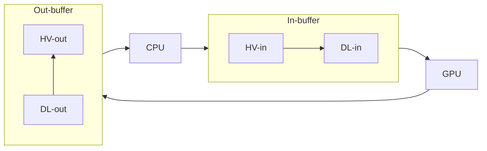

# Collatz Conjecture Simulator

A program to efficiently determine the total stopping time of the Collatz sequence of any 128-bit integer, and find all
starting values $`n`$ whose total stopping time is the greatest of all integers in the interval $`[1,\,n]`$.

## Mathematical Notation

This document assumes familiarity with mathematical concepts including sequences, functions, recursion, and modular
arithmetic. Additionally, the following conventions and notation will be used.

- $`0\notin\mathbb N`$.
- $`\mathbb N^*=\mathbb N\cup\{0,\infty\}`$.
- $`f^0(x)=x`$ and $`f^n(x)=(f\circ f^{n-1})(x)`$ for any function $`f`$, real $`x`$, and natural $`n`$.

## The Collatz Conjecture

The [Collatz Conjecture](https://en.wikipedia.org/wiki/Collatz_conjecture) is an iconic unsolved problem in number
theory. It regards the _Collatz function_ $`f:\mathbb N\to\mathbb N`$, commonly defined as

```math
f(x)=
 \begin{cases}
  \frac12x &\text{if }x\text{ is even,}\\
  3x+1     &\text{if }x\text{ is odd.}
 \end{cases}
```

The _Collatz sequence_ of some $`n\in\mathbb N`$ is the infinite sequence $`(f^i(n))_{i=0}^\infty`$ in which the element
at index $`i`$ is given by the $`i`$-th recursive application of the Collatz function evaluated at the _starting value_
$`n`$. A _cycle_ is a finite contiguous subsequence $`(a_i)_{i=0}^k`$ of a Collatz sequence in which every element is
distinct and $`f(a_k)=a_0`$. The _trivial cycle_ is the cycle $`(1,4,2)`$.

If the Collatz sequence of $`n`$ contains some element less than $`n`$, then the index of the first such element is the
_stopping time_ of $`n`$. So $`k`$ is the stopping time of $`n`$ iff $`f^k(n)<n`$ and $`f^i(n)\ge n`$ for all $`i<k`$.
Similarly, if the Collatz sequence of $`n`$ contains the value $`1`$, then the index of the first element of value $`1`$
is the _total stopping time_ of $`n`$. So $`k`$ is the total stopping time of $`n`$ iff $`f^k(n)=1`$ and $`f^i(n)>1`$
for all $`i<k`$.

The following additional notation and terminology will be used. A _step_ is a single application of the Collatz
function. The _step count function_ $`s:\mathbb N\to\mathbb N^*`$ outputs the total stopping time of the argument, if it
exists. Otherwise, it outputs positive infinity.

The Collatz Conjecture posits that every natural number has a finite total stopping time. This means

```math
\forall n\in\mathbb N\,,\;\exists k\in\mathbb N\,,\;f^k(n)=1\,.
```

## The Simulation

Collatz Conjecture Simulator aims to find the starting values with the greatest total stopping times. That is, positive
integers $`n`$ such that $`s(n)>s(m)`$ for all $`m<n`$. Total stopping times are calculated by iterating through Collatz
sequences and counting each step until a value of $`1`$ is found. Because each such iteration is computationally
independent, the program uses the GPU to iterate through multiple Collatz sequences in parallel. The GPU is accessed via
the Vulkan API and uses compute shaders to perform the iterations. Collatz Conjecture Simulator is primarily written in
C, however the shaders are written in GLSL and compiled to SPIR-V.

## Program Requirements

The general environment and system requirements that must be met for Collatz Conjecture Simulator to build and run
correctly are listed below. The full requirements of the GPU are given in
[device_requirements.md](device_requirements.md).

- [C](https://en.wikipedia.org/wiki/C_(programming_language))17
  - Atomic operations via the `stdatomic.h` header  (Optional C11 feature)
  - 128-bit integers via the `__int128` type (GNU C extension)
  - Conditional expressions with omitted operands (GNU C extension)
- [CMake](https://cmake.org) 3.24
- [glslang](https://github.com/KhronosGroup/glslang)
- [pthreads](https://en.wikipedia.org/wiki/Pthreads)
- [SPIR-V Tools](https://github.com/KhronosGroup/SPIRV-Tools)
  - `spirv-link`
  - `spirv-opt`
  - `spirv-dis`
- [Vulkan](https://www.vulkan.org) 1.1
  - `VK_KHR_copy_commands2`
  - `VK_KHR_maintenance6`
  - `VK_KHR_map_memory2`
  - `VK_KHR_synchronization2`
  - `VK_KHR_timeline_semaphore`

In addition, the platform must be capable of using either little-endian or big-endian byte order consistently for all
memory accesses and operations the program performs. That is, the computer should not switch between the two byte orders
in its execution of the program.

## Building and Running

Collatz Conjecture Simulator is built via CMake. Comprehensive documentation regarding usage of CMake can be found at
the [CMake website](https://cmake.org/cmake/help/latest). To generate the build system, navigate the terminal to the
project directory and execute the following command.

```bash
cmake -S . -B build
```

Several options can be specified to customise the build system by appending `-D OPTION=CONFIG` to the above command.

- `CMAKE_BUILD_TYPE` specifies the build variant and can be set to _Debug_, _Release_, _MinSizeRel_, or
  _RelWithDebInfo_. If not set, it defaults to _Debug_.
- `CLTZ_EXCESS_WARNINGS` specifies whether to compile the program with a potentially excessive amount of warnings, and
  defaults to _OFF_.
- `CLTZ_STATIC_ANALYSIS` specifies whether to statically analyse the program during compilation, and defaults to _OFF_.
- `CLTZ_DEBUG_SHADERS` specifies whether to include debug information in generated SPIR-V, and defaults to _OFF_.
- `CLTZ_OPTIMISE_SHADERS` specifies whether to optimise generated SPIR-V using `spirv-opt`, and defaults to _ON_.
- `CLTZ_DISASSEMBLE_SHADERS` specifies whether to disassemble generated SPIR-V using `spirv-dis`, and defaults to _OFF_.

Once the above command has finished, a `build` directory will have been created containing the build system. To now
build Collatz Conjecture Simulator, execute the following command.

```bash
cmake --build build
```

By default, only the executable will be built. To instead build the SPIR-V, add `--target spirv`. To build both, also
add `--target cltzExe`. To specify the build configuration, add `--config CONFIG` (only applies for multi-config
generators).

The above command will create a `bin` directory containing the SPIR-V and executable. If built in debug, the executable
will be named `cltz-dbg`. Otherwise, it will be named `cltz`. The executable can be moved to a different file location,
but the SPIR-V must also be moved alongside it, else the program will be unable to locate the generated SPIR-V.

The executable provides a command line interface and uses the initial command line parameters to specify the operation
of the program. Parameters beginning with a double hyphen (--) reference options. Some options themselves accept a
parameter, which must be given immediately following the option as the next CLI parameter. To view a comprehensive list
of options, use the `-h` or `--help` option.

In most cases, the executable will initiate the program's main loop. If during this process the `Enter` or `Return` keys
are pressed, the program will break from the main loop and begin to exit. Each iteration of the main loop will output
information regarding the computations performed, most prominently including benchmarking data for various subprocesses.

### Common Problems

If running the program results in a `VK_ERROR_DEVICE_LOST` error message, it may be due to the compute shaders taking
too long to execute. On many operating systems and graphics drivers, if the GPU spends too much time processing a single
request, the operation can timeout to prevent the GPU from freezing. Such a scenario is explicitly mentioned in the
Vulkan specification (version 1.4.326, section 5.2.3 _Lost Device_).

> Typical reasons for device loss will include things like execution timing out (to prevent denial of service), power
> management events, platform resource management, implementation errors.

In this case, the error can be fixed by running the program with a lower proportion of accessible GPU memory, resulting
in less computation time per compute dispatch. This is done by adding the `--max-memory` option, followed by the
proportion of available GPU memory that will be accessible to the program. For example, `--max-memory 0.2` means the
program will use at most 20% of the available GPU memory.

## Inout-buffers

To facilitate this use of the GPU, _inout-buffers_ are used. Inout-buffers are ranges of GPU memory within `VkBuffer`
objects and consist of an _in-buffer_ and _out-buffer_. In-buffers are shader storage buffer objects (SSBOs) and contain
an array of 128-bit unsigned integer starting values. Out-buffers are also SSBOs and contain an array of 16-bit unsigned
integer total stopping times.

The main loop consists of the CPU writing starting values to in-buffers; the GPU reading starting values from
in-buffers, iterating through Collatz sequences, and writing total stopping times to out-buffers; and the CPU reading
total stopping times from out-buffers. The number of inout-buffers is dependent on the system's specifications. There
are one or more inout-buffers per `VkBuffer` object, one `VkBuffer` object per `VkDeviceMemory` object, and two or more
`VkDeviceMemory` objects.

Collatz Conjecture Simulator attempts to minimise the time spent idle by the CPU and GPU due to one waiting for the
other. Such as the GPU waiting for starting values, or the CPU waiting for total stopping times. This is done by having
an even number of `VkDeviceMemory` objects, where half contain memory close to the GPU (device local memory) and half
contain memory visible to both the CPU and GPU (host visible memory). There are thus four types of memory ranges: host
visible in-buffers (HV-in), host visible out-buffers (HV-out), device local in-buffers (DL-in), and device local
out-buffers (DL-out).

Rather than the CPU and GPU taking turns executing, both processors spend time running in parallel. The CPU reads from
and writes to host visible inout-buffers, and the GPU reads from and writes to device local inout-buffers,
simultaneously. Starting values are written to HV-in, copied from HV-in to DL-in, and read from DL-in. Total stopping
times are written to DL-out, copied from DL-out to HV-out, and read from HV-out.



## Starting Value Selection

A property of the step count function is that if a starting value $`n`$ has a Collatz sequence containing the starting
value $`m`$ at index $`k`$, then $`s(n)`$ can be expressed as the sum of $`s(m)`$ and $`k`$. That is, $`f^k(n)=m`$
implies $`s(n)=s(m)+k`$. It can be mathematically demonstrated that particular starting values will always have Collatz
sequences with finite stopping times. So for such starting values $`n`$, there must be some index $`k`$ such that
$`f^k(n)=m`$ for some $`m<n`$. As such, by knowing the values of $`s(m)`$ and $`k`$, it is possible to calculate the
total stopping time of $`n`$ as their sum rather than by iterating through the Collatz sequence of $`n`$.

This can be advantageous since a single addition operation is significantly less computationally intensive than
iterating through a Collatz sequence. It can also allow for greater parallelism if such calculations are performed by
the CPU, as this would have both the CPU and GPU calculating total stopping times and thereby more evenly splitting the
workload between the two processors. For these reasons, Collatz Conjecture Simulator partitions the workload for
calculating total stopping times between the CPU and GPU according to this logic. In particular, two sets of starting
values are allocated to the CPU.

The first set is the even starting values; all $`n\in\mathbb N`$ such that $`n\equiv0\pmod2`$ and hence $`n=2m`$ for
some $`m\in\mathbb N`$. A single step from $`n`$ results in $`f(2m)=m`$, meaning $`s(2m)=s(m)+1`$.

The second set is the starting values $`n`$ such that $`n\equiv1\pmod4`$ and hence $`n=4m+1`$ for some
$`m\in\mathbb N`$. Stepping three times from $`n`$ results in $`f^3(4m+1)=f^2(12m+4)=f(6m+2)=3m+1`$, meaning
$`s(4m+1)=s(3m+1)+3`$.

The union of these two sets excludes only starting values $`n`$ such that $`n\equiv3\pmod4`$, whose total stopping times
are calculated by the GPU. The remaining starting values' total stopping times are calculated by the CPU.

## Licensing

Collatz Conjecture Simulator is licensed under version 3 of the GNU General Public License (GPLv3). A copy of this
licence should be [included](COPYING) with Collatz Conjecture Simulator. Otherwise, the licence may be viewed at the
[GNU website](https://www.gnu.org/licenses/gpl-3.0.html).

The building of Collatz Conjecture Simulator is dependent on a number of external works, each with their own licence or
licences. The below table lists each such work with its corresponding licence or licences, in alphabetical order.

| Work                     | Licences        |
| ------------------------ | --------------- |
| cwalk                    | MIT             |
| volk                     | MIT             |
| Vulkan-Headers           | Apache-2.0, MIT |
| Vulkan-Utility-Libraries | Apache-2.0      |
| whereami                 | MIT, WTFPLv2    |

Each listed work is provided in the [lib](lib) directory as a git submodule. The licence or licences of each work can be
obtained by either navigating to the online repository of the work or cloning the respective submodule. The former can
be achieved by using the respective submodule URL given in the [.gitmodules](.gitmodules) file. The latter can be
achieved by cloning this repository with the `--recurse-submodules` option.

Additionally, the generic contents of each listed licence can be obtained by following the respective embedded hyperlink
in the below list, given in alphabetical order.

- [Apache-2.0](https://www.apache.org/licenses/LICENSE-2.0)
- [MIT](https://opensource.org/license/mit)
- [WTFPLv2](https://wtfpl2.com)

### Artificial Intelligence

The author of Collatz Conjecture Simulator is not a lawyer, but strongly believes the usage of GPLv3-licensed works in
the training and development of proprietary AI is necessarily violating of said licence. However, in the event the GPLv3
does not in itself encompass the above restriction, the following shall apply.

Collatz Conjecture Simulator includes in its terms and conditions regarding copying, distribution, and modification, in
addition to those provided by version 3 of the GNU General Public Licence, the strict prohibition of its usage by
artificial intelligence software not licensed in their entirety, as a whole, under version 3 or later of the GNU General
Public Licence, including but not limited to the training, prompting, or generation of such artificial intelligence
models or algorithms.
